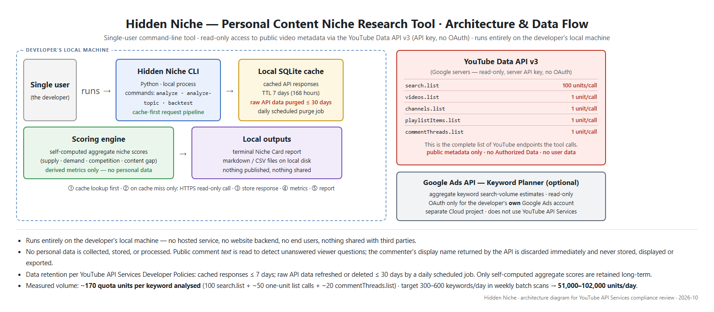

# Hidden Niche — Personal Content Niche Research Tool

Hidden Niche is a personal, internal command-line research tool that helps its single user (the developer) plan their own video content. It measures content supply and demand for candidate topics by reading **public** video metadata through the official **YouTube Data API v3**.

## What it does

- Searches public video metadata for candidate topic keywords (`search.list`).
- Retrieves public video statistics, channel statistics, and channel uploads (`videos.list`, `channels.list`, `playlistItems.list`).
- Reads public top-level comments on those videos (`commentThreads.list`) to find questions viewers are still asking, which indicate gaps in existing content.
- Optionally reads aggregate keyword search-volume estimates for candidate topics from the developer's own Google Ads account through the **Google Ads API** Keyword Planner (`KeywordPlanIdeaService`), as an additional demand signal. Read-only: the tool never creates, changes, or spends anything in any Google Ads account.
- Computes self-derived aggregate niche scores (supply, demand, competition).
- Outputs reports as command-line text and local markdown files.

The complete list of YouTube Data API endpoints the tool calls is exactly the five above: `search.list`, `videos.list`, `channels.list`, `playlistItems.list`, `commentThreads.list`.

## What it is NOT

- Not public-facing: no hosted service, no app distribution. This page is the tool's only web presence.
- No user accounts and no sign-in for anyone else. YouTube data is read with a server API key only (no OAuth). OAuth is used for exactly one purpose: the developer authorizing the tool to read Keyword Planner data from **their own** Google Ads account (scope `https://www.googleapis.com/auth/adwords`). No other person's Google account is ever connected.
- Does not collect, store, or share data about any person.

## Access

Command-line only, running locally on the developer's machine. This page serves as the tool's public description page for the YouTube API Services compliance review.

## Privacy

See the [Privacy Policy](./PRIVACY.md).

## Contact

doxuankinh@gmail.com
